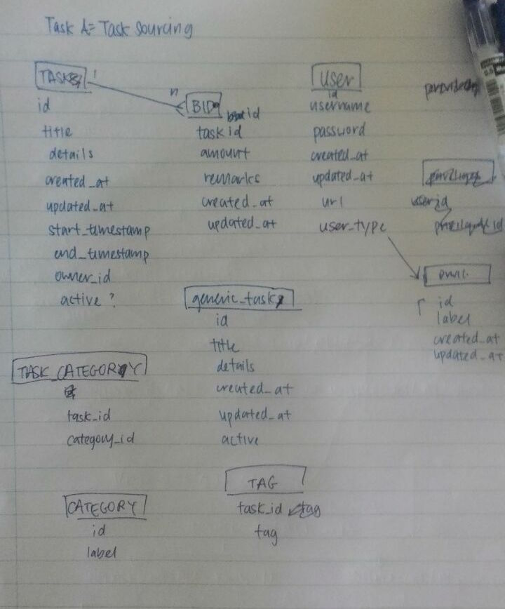

# Plans for 2102 Group Project

## Components/Entities

1. Task
2. Bid
3. User
4. Privileges
5. Generic Tasks
6. Category
7. Tag
8. Admin Dashboard

## Design choices/Justifications

### 1. Task

- can be toggled between active or inactive.

### 2. Bid

- Will appear mostly in the task page

### 3. User

### 4. Privileges
- User privileges. For now 1: admin 2: user

### 5. Generic Tasks

Will provide a few options determined by admin.

## Features/Queries for each Components

### 1. Task

1. Fetch all tasks (with pagination)
2. Fetch tasks based on filter and order
  - active tasks
  - expiring tasks
3. Create task
4. Read task
5. Update task
6. Delete task

### 2. Bid (Displayed in individual task page)

1. All bids if bidding is "public"

#### For task creator

1. Statistics about bid process
  - Aggregate by day
  - Aggregate by day of week
  - Aggregate by time
  - How many users bid more than once
  - Number of bids compared in similar category

### 3. User
  - Create account
  - Edit account details
  - Login
  - Logout

#### For Admin
  - Delete account
  - Edit account details of all users
  - Statistics about users
    - Number of users who login in past week
    - Bid per user per week
    - Post per user per week

### 4. Privileges
#### For Admin
  - CRUD Admin
  - Change user privileges (except self)

### 5. Generic Tasks
#### For Admin
  - CRUD generic tasks

### 6. Category
#### For Admin
  - CRUD categories

### 7. Tag
#### For Admin
  - CRUD tags

### 8. Admin Dashboard
  - View all statistics in one page
